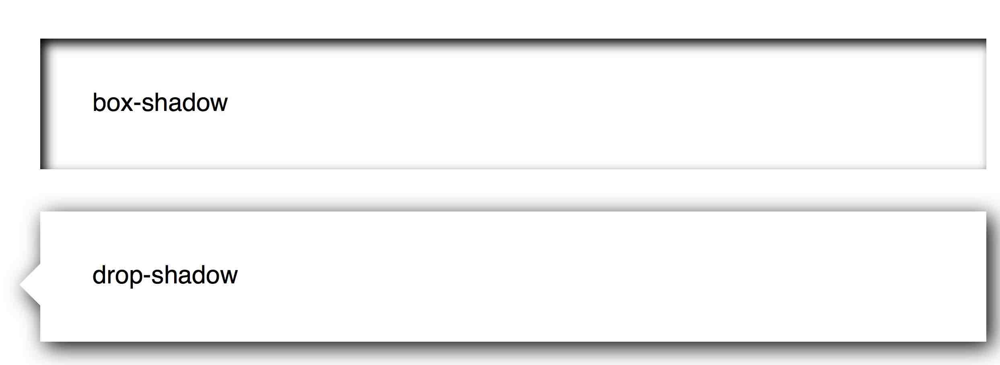

##前端问题总结

在平时的项目上我们总会遇到这样那样的问题，有时候为了赶项目我们不得不采取采取一些简单的但未必是最好的解决方案，所以我在空闲的时候就像把这些当时做出来的不是最优解决方案的一些问题重新梳理一下，然后找到最优解决方案，参照一些大网站的作法使得自己的网站更扎实，更稳定！

---

###1.多个大小相同的li自动循环

我们先来看一下图中：

旧解决方案：

ul + li  都按百分比，然后一行四个的话，每个li宽度都是25%，然后统一设置padding-right的值，再用css3的:nth-child(4n)将每个4n个li的padding值设置为0，之前一直这样做，但是一直都知道这样是不对的，你们也许发现了，如果最后一个padding值为0的话那么宽度自然就会比其他有padding值的li要宽，所以这个不是最优解决方案！

新方案：

最近浏览GitHub官网发现人家有一个页面也是这个排版，但是几个盒子大小都是出奇的一致，所以我就看了下，有兴趣了也可以自己浏览[点击这里](https://github.com/explore)，这个解决方案就是把父级元素的margin值设置为父，然后里面的盒子该怎么设置还怎么设置，这样自己元素就不会因为外间距的问题折行了，比如子元素的margin-right都为15px,那么就把ul的margin-right设置为-15px，这样就好了，原理暂时不清楚，待探究~

补充：这个其实有很多方案的，像是直接盒子布局不要布局padding而是换成margin可能也可以解决这个问题！

###2.左侧小三角的css实现

这个其实主要讲的是drop-shadow和普通box-shadow的差别，drop-shadow其实才算是真正意义上的投影，而box-shadow可能用阴影来描述更为合适；(但是目前drop-shadow兼容性并不是很好，慎用)

###3.字体上下间隙的解决方法
我们都知道当定义了字体大小之后，字体上下总会有些间隙不能去除，用line-height=100%可能可以解决你的这一大烦恼；

###4.CSS 截断字符串
单行截断字符串,这里必须指定字符串的宽度

	/* 指定字符串的宽度 */
    
    width:300px;   
    
    overflow: hidden;  
    
    /* 当字符串超过规定长度，显示省略符*/ 
    
    text-overflow:ellipsis;  
    
    white-space: nowrap;  

###5.去掉 a，input 在移动端浏览器中的默认样式

####5.1.禁止 a 标签背景
在移动端使用 a标签做按钮的时候，点按会出现一个“暗色”的背景，去掉该背景的方法如下

a,button,input,optgroup,select,textarea {
    -webkit-tap-highlight-color:rgba(0,0,0,0); /*去掉a、input和button点击时的蓝色外边框和灰色半透明背景*/
}

####5.2.禁止长按 a，img 标签长按出现菜单栏
使用 a标签的时候，移动端长按会出现一个 菜单栏，这个时候禁止呼出菜单栏的方法如下：

a, img {
    -webkit-touch-callout: none; /*禁止长按链接与图片弹出菜单*/
}

####5.3.流畅滚动

body{
    -webkit-overflow-scrolling:touch;
}

###6.去掉selected默认的样式

刚才看到张鑫旭大大的博客才知道，appearance还有很多属性，但是可能目前支持兼容性不是很好，有一个***menulist***我觉得在处理select的时候可能用的上，**另外这个属性并不是专属于select的，而是所有input输入框都拥有这个属性！**

	appearance:none;
	-moz-appearance:none;
	-webkit-appearance:none;
	
===
	
IE10浏览器下，**::-ms-expand**可以改变下拉框元素的下拉按钮样式。

	::-ms-expand {
    	padding: .5em;
    	color: #34538b;
    	border: 1px solid #a0b3d6;
    	background: #f0f3f9;
	}

	
	
###7.IE9下的兼容代码

	<!--[if lt IE 9]>
	
	
	<![endif]-->
	
###8.display: table-cell;与大小不一定的元素的垂直居中

	/*这里的大小是根据高宽上限128像素图片设置的*/
	div {
		display:table-cell;  /* 重点1 */
		width:1em; 
		height:1em; 
		border:1px solid #beceeb; 
		font-size:144px;
		text-align:center;  /* 重点2 */
		vertical-align:middle; /* 重点3 */
	} 
	div img{
		vertical-align:middle; /* 重点4 */
	}
	
	
	
###9.让英文同汉字一样自动换行
因为很多时候我们没有注意到同样的盒子内部有时候输入汉字他能够自己折行，按照盒子大小自动换行，但是英文却不行，这个很常见，但是为了是自己有个记性，特写在此！	

	word-break: break-all;

###10.让图片或者文字垂直居中的方法（vertical-align）

	html:
	
<i></i>

	
	css:
	img { vertical-align: middle;}
	
	i {
	display: inline-block;  	/* inline-block化 */
	width: 0;					/* 0宽度100%高度的辅助元素 */
	height: 100%;
	vertical-align: middle;
	}
	
	
	
	
###11.给input的placeholder文字设置色值

IE浏览器下的写法：

	:-ms-input-placeholder {
    	color: mediumvioletred;
    	text-indent: 5px;
	}
	
Chrome浏览器：

	::-webkit-input-placeholder {
    	color: mediumvioletred;
    	text-indent: 5px;
	}
	
FireFox浏览器：FireFox浏览器下占位符文字的透明度默认是0.54，因此需要强制opacity: 1让placeholder值颜色与IE/Chrome一致。
	
	::-moz-placeholder {
    	color: mediumvioletred;
    	text-indent: 5px; /* 不起作用 */
    	opacity: 1!important;
	}

###12.伪元素::-ms-value
可以更改文本框(如type=text, type=password等)以及下拉框(select)的样式。例如下面的HTML代码：

	::-ms-value {
    	padding: 4px;
    	color: #34538b;
    	border: 1px solid #a0b3d6;
    	background-color: #f0f3f9;
	}
	
###13.display: inline-block 引起的间隙问题
现在我们布局列表的时候很少用到float浮动了，因为浮动会让盒子的高度塌陷，随之会出现很多令人头痛的问题，现在我们大概都使用display： inline-block比较多，但是这个又会因为换行导致元素块与块之间会产生一定的间隙

1.处理这个间隙我们一般的方法是用**font-size：0；**

2.但是有时会因为就兼容性失效，那就在介绍一个别的方法，就是**letter-spacing： -4px；**这个兼容性较之稍微好一点；

###14.不同尺寸的icon小图标自动居中最佳方案

这些小的问题解决方案都是摘自张鑫旭大大<http://www.zhangxinxu.com>的博客，有兴趣的同学可以自己到他的网站中查看，说不定自己也没能收货很多意想不到的东西哦~

这里只是展示主要代码，详细案例在HTML网页中有实例：

	.icon {
		display: inline-block;
		width: 20px;	
		height: 20px;
		background: url("image/icon.png") no-repeat center;
		white-space: nowrap;
		letter-spacing: -1em;
		text-indent: -99em;
		color: transparent;
		}
	<!-- 这个很重要，是决定icon居中的核心 -->
	.icon:before {	content: '\3000';	}		

###15、关于空格符 &ensp;和&emsp;

其中的&ensp;和&emsp;，由于具有某一超赞的特性，使其可以登上web届的舞台！什么特性呢？如上表加粗展示
       1. 透明； 
       2. 宽度正好跟中文正好是1:2和1:1的关系
于是，一些中文排版对齐什么的，直接就可以使用这两个空格调节，如：

 
结果轻松实现了2字/3字/4字中文的等宽两端对齐效果了
	

